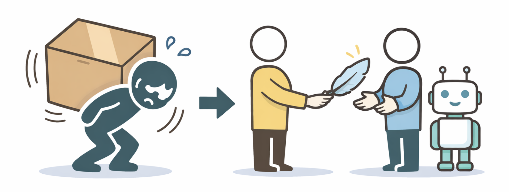
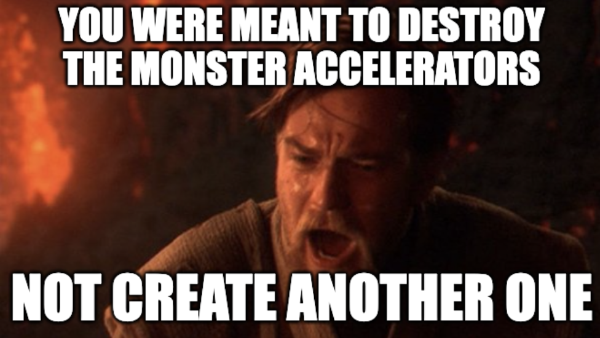

:::{.post-thumbnail}

:::

## Introduction

Sharing hard-earned software engineering lessons has always been hard. It
requires both an upfront and a maintenance investment. Importantly, if you don't
strike a fine balance between approachable and useful, it may be for naught.

For the last four years, I maintained and iterated through several versions of
[azureml-scaffolding][scaffolding], a template/accelerator to fulfill the
[hypothesis-driven development][hdd] promise: enable continuous experimentation
without compromising production deployment for AI projects. I sank countless
hours into it trying to make it more useful to more people but until now I
struggled to find a balance of depth and accessibility. In this post, I explore
why that changed.

## The journey

It all started with the principles:
[A layered approach to MLOps][layered-mlops]. From these, we built what we now
refer to as v1 of [azureml-scaffolding][scaffolding]. A starting point, a
reference architecture that we hoped would marry rapid iteration loops in
machine learning products and solid engineering practices that allowed making it
into production without a phase change.

In v1, we tried to provide just enough to deliver on the promise while still
enabling heavy customisation. As we believed, and still do, no two projects are
made equal. This meant it started simple and significantly non-assuming. It
worked, it was used in several projects and we learned from it. We started
seeing patterns across projects and getting tired of reimplementing the same
things over and over.

This motivated v2, in which we tried to bring all the learnings into a solution
that offered even more. We added a full bash CLI, pipelines, data management,
solid experimentation tracking and more. The use of uv for solid environment
management. All the new features were useful, it all seemed like a nice
evolution. But two things became apparent:

1. **Each project needs its journey**. Even if you know where you are going,
   every project's specific needs require incremental adaptation. The more
   complex your starting point, the harder that becomes and the higher the
   probability that you just decide to start from scratch.

1. **The principles got overshadowed**. The scaffolding was built around clear
   guiding principles. These are more important than any specific
   implementation. The problem is that precisely because the implementation got
   huge, people understandably focused on the *what* and missed the *why*.

This essentially meant that fewer new people were actually leveraging the
scaffolding as it was a pill too tough to swallow, and the ones that did easily
got confused on how to use it. At the same time, the people that were familiar
with the accelerator and did use it, myself included, never took the whole
thing. We just copied the parts that we needed. Our solution had become what we
swore to destroy.

Looking back, a fundamental tension becomes apparent: **templates are either
approachable or comprehensive**. The more knowledge you pack in, the harder it
is to transfer. With the tools at our disposal at the time, this was the best we
could do and there was no obvious solution beyond loads of evangelizing and
support.

## What changed

Last October, Anthropic introduced [agent skills][skills-blog]. A skill, in its
core, is simply a body of knowledge an agent has access to. The powerful idea
behind them is, in my opinion, **progressive disclosure**: read only what you
need, when you need it. Knowledge is layered.

This hinted at a solution to the tension we mentioned above. So we built v3 of
the `azureml-scaffolding`. Now a skill instead of a template. To migrate it, we
largely followed the [`skill-creator` skill][skill-creator] from Anthropic. The
`SKILL.md` outlines the principles which should guide all generation. `assets/`
contains a modern version of v1 which is lean and self-contained, the core
building blocks meant to be copied and then adapted. `references/` includes
advanced patterns, extensions (previously baked into v2) as markdown for when
the user's project is ready for them, with code snippets inlined to modify the
core assets. In `scripts/` we include complex executions of simple ideas (e.g.,
git shenanigans for good diffs in experiments) referenced by extensions and
meant to be copied too. In general, we aim to use artifacts to anchor the
generation, to ensure it steers toward our ideas and not the internet's default.
**Be prescriptive on what truly matters and enable generation for
customisation**.

This works for two reasons:

1. **The model does the plumbing**. Before, the only way to support
   functionality was to fully implement it. That is why v2 became so large. Now,
   the model can take the principles and a lean starting point and expand into a
   working solution in context. Supporting pipelines went from a fully working
   template with multiple packages and associated bash scripts to a lean text
   file with mainly thinking principles.

1. **The model becomes a teacher**. The hardest part was always sharing the
   vision. Without having experienced the pains the template was solving, it was
   hard for people to understand how the pieces fit together and it often
   required a conversation with me. Now users can ask questions. Deciding what
   is the correct layer to register a trained model does not need to be
   documented explicitly at length. Interestingly, this means the model
   **doubles as a reviewer**, as it can be used to validate that changes adhere
   to principles.

## The bigger picture

LLMs can be understood as a
[lossy compression of the internet][lossy-compression]. An internet which
incidentally contains most of what there is to know about software engineering
and related disciplines. Thus, in a way, the **models serve as contextualized
decompression engines of the knowledge we aim to share**. This was not
impossible before, but it required your reader to be knowledgeable enough to
make this decompression themselves, therefore limiting the realistic audience.
Ironically, these knowledgeable readers tended to know enough not to be willing
to swallow the big pill. But now they get to pick and choose the small bits they
value.

This means that the tension is largely gone: **we no longer face the trade-off
of comprehensive but scary or approachable but limited**. We can focus on the
key ideas with some examples to serve as direction and trust the model will be
able to apply them. It is still early and requires some experimentation to find
the right level of abstraction, but it works. And as the bar for sharing drops,
maybe more people will.

I find it beautiful that skills (and LLM usage in general) align incentives:
**good writing pays off in good functionality**. This means that most skills
serve as learning material on their own, can easily be digested by human
readers, and make it rather easy to bring a skill into your repo and adapt it at
will.

For the people who want to become knowledgeable, there are unprecedented
opportunities. **The model is not only a decompressor, but a tutor**. Infinitely
patient, they can elaborate, answer questions and guide you through the
material. While it is possible to just blindly let the LLM do the work, the keen
will learn much faster.

## Open Questions

There are still questions for which I don't have answers yet:

- If we do not need to fully implement what we aim to share, how can we test it
  works? Especially when, like scaffolding, there are many extension patterns
  that interact with each other and create a significant number of possible
  permutations.
- What happens when we aim to compose the use of multiple adjacent skills?
- Do we have to test all of this? Can we? In the end, models are able to
  bootstrap solutions until they work but I'd bet that solid design and
  well-thought-out boundaries are as important as ever.
- What happens when the LLM misinterprets our ideas? Is this different than when
  a colleague does?

In any case, I am the happiest I have ever been with the state of the template,
now a skill.

[hdd]: https://bepuca.dev/posts/hdd-for-ai
[layered-mlops]: https://medium.com/data-science-at-microsoft/a-layered-approach-to-mlops-d935beefca2e?source=friends_link&sk=acb75fa6fc74a8db7e36f4262a3b0a06
[lossy-compression]: https://youtu.be/7xTGNNLPyMI?si=VIZLBztIYDj1PxkK&t=2982
[scaffolding]: https://github.com/bepuca/azureml-scaffolding
[skill-creator]: https://github.com/anthropics/skills/blob/main/skills/skill-creator/SKILL.md
[skills-blog]: https://claude.com/blog/skills
